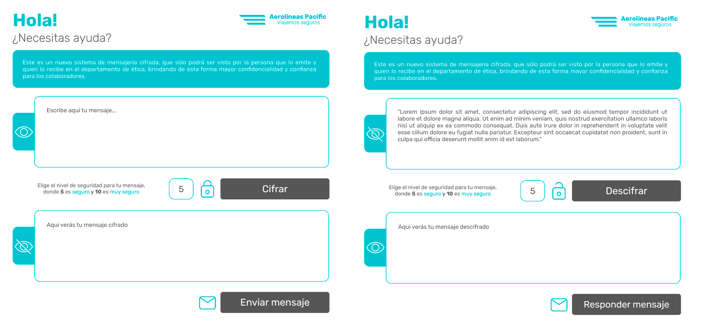

#  ¿Conversemos?

"A todos nuestros colaboradores, les comunicamos que hemos puesto en marcha un nuevo canal de transparencia dentro de la empresa, que tiene como objetivo facilitar y generar una instancia de comunicación fluida con el departamento de RR.HH., de una manera autónoma y segura.

Este nuevo canal permitirá a ustedes, nuestros colaboradores, expresar molestias, injusticias o cualquier tipo de denuncia que consideren que está afectando el desempeño y/o ambiente laboral.

Este es un nuevo sistema de mensajería cifrado, que sólo podrá ser visto por la persona que lo emite y quien lo recibe en el departamento antes mencionado, brindando de esta forma mayor confidencialidad y confianza a la persona que necesite hacer uso del canal".
##### (Introducción a la página en la plataforma virtual de la empresa)
### ¿Conversemos?
Es un proyecto para **Aerolíneas Pacific Viajemos Seguros**, quienes están buscando diseñar un espacio de ayuda entre sus colaboradores y el canal de ética de RR.HH. De acuerdo a esto se indentifica la necesidad de poder expresar de una manera fluida, confidencial y sin ser particularmente presencial, las problemáticas, denuncias y/o molestias que ellos consideren pertinentes.

Para cumplir con el objetivo se trabaja en una página a modo de pestaña, que estará integrada en una plataforma virtual que manejan los colaboradores de la empresa, por lo tanto, se busca que sea coherente con la línea gráfica y funcional de ella, para generar cercanía con el lenguaje ya internalizado por los usuarios.

Por otro lado, una de las cosas que buscan los trabajadores, nuestros usuarios, es que sea lo más confidencial posible, es de acuerdo a esto que se decide emplear un método de cifrado, lo que significa que cada mensaje enviado por uno de los colaboradores será encriprado y solo podrá ver el contenido real quien recibe, en este caso el profesional en RR.HH. El mecanismo funciona para ambos lados de la misma forma, por lo tanto, el emisor también se convierte en receptor teniendo que traducir el mensaje que le han enviado como respuesta.

## Cifrado César
El método que se usa es el cifrado César, uno de los más conocidos y usados. Esta técnica es una de las mas simples para cifrar un mensaje. Es un tipo de cifrado por sustitución, es decir que cada letra del texto original es reemplazada por otra que se encuentra un número fijo de posiciones (desplazamiento) más adelante en el mismo alfabeto.

Por ejemplo, si se usa un desplazamiento de 3 posiciones:

- La letra A se cifra como D.
- La palabra CASA se cifra como FDVD.
- Alfabeto sin cifrar: A B C D E F G H I J K L M N O P Q R S T U V W X Y Z
- Alfabeto cifrado: D E F G H I J K L M N O P Q R S T U V W X Y Z A B C

En la actualidad, todos los cifrados de sustitución simple se descifran con mucha facilidad y, aunque en la práctica no ofrecen mucha seguridad en la comunicación por sí mismos; el cifrado César sí puede formar parte de sistemas más complejos de codificación, como el cifrado Vigenère, e incluso tiene aplicación en el sistema ROT13.

## Definición del producto

Para comenzar a proponer soluciones a la problemática identificada es necesario conocer a quién está dirigido, qué se quiere lograr y cómo se va a realizar.

#### ¿Quiénes son los usuarios?
Los usuarios del producto son clientes internos de la empresa donde ha sido díficil establecer una comunicación transparente entre jerarquías. El cliente interno tiene necesidades, tiene malestares e incluso denuncias de mayor impacto que no se pueden expresar al azar. Actualmente no existen herramientas efectivas y eso se traduce en más malestar y frustación, es de acuerdo a todos esos antecedentes que resulta ser una necesidad crear una instancia para que ellos de manera secreta puedan comunicarse con los profesionales que corresponde.

#### ¿Qué se quiere lograr?
Que el producto sea una herramienta de comunición entre los usuarios y el departamento de RR.HH. de la empresa. Logrando relaciones mucho más fluidas y dando apoyo a quienes lo necesiten. **¿Conversemos?** viene a dar una mano amiga a quien la necesita, dentro de un ambiente de confianza y seguridad. 

#### ¿Cómo se logrará?
A través del diseño de un producto que se basa en un flujo de trabajo reconocido y familiar para los usuarios. Se propone un lenguaje claro y génerico que no sea complejo, para lograr que las acciones se lleven a cabo autónamente.

## Definir la interfaz de usuario

El usuario debe:

- Ingresar un mensaje (texto) que quiera cifrar.
- Elegir un desplazamiento indicando cuántas posiciones quiere que el cifrado desplace cada carácter.
- Ver el resultado del mensaje cifrado.
- Insertar un mensaje (texto) a descifrar.
- Ver el resultado del mensaje descifrado.

## Decisiones de Diseño

Con todo lo antes ya mencionado se propone a nivel de sketch como debe estar estructurado el producto.

### Funcionalidad

El sketch tiene dos páginas de interacción:

* La primera página es la de inicio, la que está destinada a comenzar la mensajería; en ella se podrá escribir el mensaje, elegir el número de desplazamiento, que está representado por un nivel de seguridad en un rango de 5 a 10, donde se considera 5 como mensaje seguro y 10 como mensaje muy seguro.
Luego se encripta el mensaje a través del botón **Cifrar** y se verá reflejado inmediatamente en el cuadro de texto en la parte inferior.
Para finalizar, el emisor puede enviarlo haciendo "click" en el botón **Enviar mensaje**, mostrando una alerta *Mensaje enviado! Estamos en contacto* confirmando el envío.

* La segunda página está considerada para el receptor del mensaje, luego de recibir una alerta  *Tienes un nuevo mensaje*, se verá en el cuadro de texto superior y se podrá traducir a través del botón **Descifrar**, ojo que también es necesario encontrar el nivel de seguridad que consideró el emisor del mensaje para encriptarlo. Este número es secreto por lo que el receptor deberá probar con los 5 posibles hasta encontrar el que sea el indicado. Es por este motivo que se usa un rango de números de desplazamiento, porque si extendemos las posibilidades el descrifrado sería casi imposible de realizar y como no es posible comunicar el número, porque es una mensajería secreta, se decide acotar y usar un rango de opciones.

* Por lo tanto, a medida que se vaya eligiendo un número y haciendo "click" en **Descifrar** el mensaje traducido se verá reflejado en el cuadro de texto de la parte inferior. Luego de conseguir descrifrar el mensaje, se puede responder a través del botón **Responder mensaje** de esta forma se mostrará la primera página convirtiendose el receptor en emisor y comenzando nuevamente un nuevo ciclo dentro de las páginas.

### Aspectos visuales

El producto tiene una estética minimalista y pregnante, con los colores corporativos de la empresa. Se usa el círculo como figura geométrica principal, considerando que es una forma que representa unidad e integración, se aplica en cantos y en iconos, entregado un lenguaje visual más suave y acogedor acorde con el objetivo de generar confianza al usuario. 

Resulta amigable con el público objetivo cuyas edades fluctúan entre los 18 y 65 años. Para las personas más adultas que no son nativas digitales y tienen que dedicar mas tiempo para adaptarse, se decide poner algunas frases explicativas sobre los cuadros donde va a ocurrir la interacción ayudando de esta forma a la compresión del flujo de acción y a su vez para que la experiencia sea mucho más amable. 

Ya con el sketch definido y de acuerdo a todo lo anterior se proponen los siguientes styleframes:

### Mockup

Con los cuadros de estilo ya establecidos se realiza un mockup en Figma, donde se trabaja con el mayor flujo de interacciones. 

Para verlo pincha [MOCKUP](https://www.figma.com/proto/rJGK9kSaYnyx8yPuRXsT8h/CIPHER-WEBPAGE-V3?node-id=2%3A1468&viewport=269%2C1292%2C0.1459026038646698&scaling=min-zoom)

### Prototipo de alta fidelidad

Con el mockup funcionando ya se comienza a trabajar directamente con el código para poder plasmar todo lo que antes se maqueteó y resulte un producto viable.

Para verlo pincha [PROTOTIPO](https://natigrottes.github.io/SCL012-Cipher/src/index.html)

## Desarrollo Front-end

### Lenguajes usados:

* HTML
* CSS
* Javascript

### Herramientas:
- GitHub y GitHub Pages

## Observaciones

Considero que queda pendiente el testeo con los usuarios reales, en primera instancia recibí feedback de mis compañeras y modifiqué algunas cosas en base el, es necesario que el prototipo sea probado por personas que no conocen de qué se trata, para saber si está cumpliendo con los obejtivos básicos de comunicación. El proceso de iteración es fundamental para ir depurando y concretar.